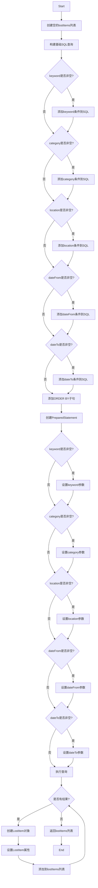

# LostItemDAO.searchLostItems方法控制流图与路径覆盖测试设计

## 1. 方法分析

选择 `LostItemDAO.searchLostItems(String keyword, String category, String location, String dateFrom, String dateTo)` 方法作为分析对象。

该方法的主要功能是根据不同的搜索条件构建SQL查询语句，并返回符合条件的失物信息列表。

## 2. 控制流图

## 3. 独立路径识别

根据控制流图，可以识别出以下独立路径：

1. **路径1**: keyword=null, category=null, location=null, dateFrom=null, dateTo=null
   - 基础查询路径，无任何筛选条件

2. **路径2**: keyword!=null, category=null, location=null, dateFrom=null, dateTo=null
   - 仅包含keyword筛选条件

3. **路径3**: keyword=null, category!=null, location=null, dateFrom=null, dateTo=null
   - 仅包含category筛选条件

4. **路径4**: keyword=null, category=null, location!=null, dateFrom=null, dateTo=null
   - 仅包含location筛选条件

5. **路径5**: keyword=null, category=null, location=null, dateFrom!=null, dateTo=null
   - 仅包含dateFrom筛选条件

6. **路径6**: keyword=null, category=null, location=null, dateFrom=null, dateTo!=null
   - 仅包含dateTo筛选条件

7. **路径7**: keyword!=null, category!=null, location!=null, dateFrom!=null, dateTo!=null
   - 包含所有筛选条件

8. **路径8**: keyword!=null, category!=null, location=null, dateFrom=null, dateTo=null
   - 包含keyword和category筛选条件

## 4. 测试用例设计

为了满足路径覆盖，需要设计以下测试用例：

### 测试用例1: 无筛选条件
- **输入**: keyword=null, category=null, location=null, dateFrom=null, dateTo=null
- **预期输出**: 返回所有失物信息列表，按创建时间倒序排列
- **覆盖路径**: 路径1

### 测试用例2: 仅keyword筛选
- **输入**: keyword="手机", category=null, location=null, dateFrom=null, dateTo=null
- **预期输出**: 返回标题或描述中包含"手机"的失物信息列表
- **覆盖路径**: 路径2

### 测试用例3: 仅category筛选
- **输入**: keyword=null, category="电子设备", location=null, dateFrom=null, dateTo=null
- **预期输出**: 返回分类为"电子设备"的失物信息列表
- **覆盖路径**: 路径3

### 测试用例4: 仅location筛选
- **输入**: keyword=null, category=null, location="教学楼", dateFrom=null, dateTo=null
- **预期输出**: 返回丢失地点包含"教学楼"的失物信息列表
- **覆盖路径**: 路径4

### 测试用例5: 仅dateFrom筛选
- **输入**: keyword=null, category=null, location=null, dateFrom="2025-01-01", dateTo=null
- **预期输出**: 返回丢失时间在2025-01-01之后的失物信息列表
- **覆盖路径**: 路径5

### 测试用例6: 仅dateTo筛选
- **输入**: keyword=null, category=null, location=null, dateFrom=null, dateTo="2025-12-31"
- **预期输出**: 返回丢失时间在2025-12-31之前的失物信息列表
- **覆盖路径**: 路径6

### 测试用例7: 所有筛选条件
- **输入**: keyword="钱包", category="证件", location="图书馆", dateFrom="2025-01-01", dateTo="2025-12-31"
- **预期输出**: 返回同时满足所有条件的失物信息列表
- **覆盖路径**: 路径7

### 测试用例8: 多个但非全部筛选条件
- **输入**: keyword="钥匙", category="其他", location=null, dateFrom=null, dateTo=null
- **预期输出**: 返回标题或描述包含"钥匙"且分类为"其他"的失物信息列表
- **覆盖路径**: 路径8

## 5. 测试执行建议

在实际测试中，需要准备以下数据：

1. 在数据库中插入多条测试数据，确保包含各种分类、地点和时间的失物信息
2. 确保某些数据满足特定的组合条件，以验证复杂查询的正确性
3. 验证返回结果的排序是否正确（按创建时间倒序）

通过以上测试用例，可以确保searchLostItems方法的所有独立路径都被执行，达到路径覆盖的测试目标。